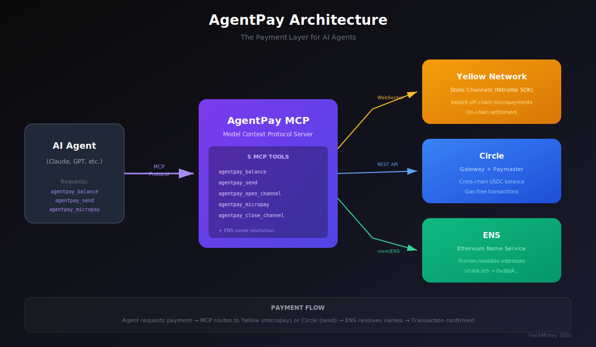

# AgentPay

**The Payment Layer for AI Agents**

AgentPay is an MCP (Model Context Protocol) server that gives AI agents a financial API. Install it and your agent can send USDC payments, stream micropayments through state channels, and settle across chains—all gas-free.

Built for HackMoney 2026 (ETHGlobal DeFi Hackathon, Jan 30 — Feb 11, 2026).

## The Problem

AI agents are doing real work: writing code, analyzing data, calling APIs. But they can't pay for anything. When an agent needs a paid service, a human must step in. That breaks the autonomous flow.

## The Solution

AgentPay gives agents money superpowers:
- **Send USDC** to any address or ENS name (gas-free via Circle Paymaster)
- **Stream micropayments** through state channels (250x cheaper than on-chain via Yellow Nitrolite)
- **Check balance** across 7 chains instantly (Circle Gateway)
- **Agent identity** via ENS (.eth names)

## Architecture



**Flow:** AI Agent → MCP Tools → AgentPay Server → Circle/Yellow/ENS → On-chain Settlement

## MCP Tools

AgentPay exposes 7 tools to AI agents:

### `agentpay_balance`
Check USDC balance across all supported chains (unified via Circle Gateway).

**Returns:** Total USDC balance, breakdown by chain

### `agentpay_send`
Send USDC to an address or ENS name. Gas paid in USDC via Circle Paymaster.

**Parameters:**
- `to` — Recipient address (0x...) or ENS name (vitalik.eth)
- `amount` — Amount in USDC (e.g., "10.50")
- `chain` — Target chain (default: base)

**Returns:** Transaction hash, gas payment method

### `agentpay_address`
Get the agent's wallet addresses (EOA and Smart Account).

**Returns:** EOA address, Smart Account address

### `agentpay_open_channel`
Open a state channel for instant micropayments. Off-chain, gas-free after opening.

**Parameters:**
- `counterparty` — Address of counterparty (0x...)
- `amount` — Initial deposit in USDC (e.g., "5.00")

**Returns:** Channel session ID, deposit amount

### `agentpay_micropay`
Send an instant micropayment through an open channel. No gas, no on-chain transaction.

**Parameters:**
- `amount` — Amount to send in USDC (e.g., "0.001")
- `sessionId` — Channel session ID (uses active channel if omitted)

**Returns:** New balance, counterparty balance, version

### `agentpay_close_channel`
Close a state channel and settle on-chain. Final balances are paid out.

**Parameters:**
- `sessionId` — Channel session ID (uses active channel if omitted)

**Returns:** Final allocations, settlement transaction

### `agentpay_resolve`
Look up an ENS name or address. Bidirectional resolution (name to address and address to name). Returns full ENS profile including text records and social accounts.

**Parameters:**
- `name` — ENS name (e.g. `vitalik.eth`) or address (`0x...`)

**Returns:** Resolved address/name, avatar, description, URL, social records (Twitter, GitHub, Discord)

## Tech Stack

- **MCP SDK** — `@modelcontextprotocol/sdk` (TypeScript)
- **Yellow Nitrolite** — `@erc7824/nitrolite` (state channels, ERC-7824)
- **Circle Paymaster** — Gas-free USDC transactions (ERC-4337)
- **Circle Gateway** — Unified USDC balance across 7 chains
- **ENS** — `.eth` name resolution via viem
- **Chain** — Base Sepolia (testnet)

## Setup

### Prerequisites

- Node.js 18+
- npm or yarn
- Test USDC on Base Sepolia

### Installation

```bash
git clone https://github.com/Cassxbt/Hackmoney2026.git
cd Hackmoney2026
npm install
```

### Configuration

Create `.env` file:

```env
AGENT_PRIVATE_KEY=0x...
AGENT_ADDRESS=0x...
NETWORK=testnet
```

Get test USDC:
1. Visit [Circle Faucet](https://faucet.circle.com/) (Base Sepolia)
2. Enter your `AGENT_ADDRESS`
3. Receive test USDC

### Build

```bash
npm run build
```

### Run

```bash
npm start
```

The MCP server will start on stdio transport, ready for AI agents to connect.

## Usage with Claude Desktop

1. Install [Claude Desktop](https://claude.ai/download)

2. Add AgentPay to your MCP config (`~/Library/Application Support/Claude/claude_desktop_config.json`):

```json
{
  "mcpServers": {
    "agentpay": {
      "command": "node",
      "args": ["/path/to/agentpay/dist/index.js"]
    }
  }
}
```

3. Restart Claude Desktop

4. Test:

```
Check my USDC balance
```

Claude should call `agentpay_balance` and return your balance.

5. Try a payment:

```
Send 1 USDC to vitalik.eth
```

Claude will resolve the ENS name and send via Paymaster.

6. Open a channel:

```
Open a micropayment channel with 0x742d35Cc6634C0532925a3b844Bc9e7595f0bEb and deposit 5 USDC
```

Then stream payments:

```
Send 10 micropayments of 0.001 USDC each through the channel
```

Close when done:

```
Close the channel and settle on-chain
```

## Cost Comparison

### Without AgentPay (on-chain)
- 1000 micropayments × $0.25 gas = **$250**

### With AgentPay (state channels)
- 1 channel open: $0.01
- 1000 off-chain micropayments: $0.00
- 1 channel close: $0.01
- **Total: $0.02**

**250x cheaper.**

## Demo

[Demo Video](https://youtube.com/watch?v=YOUR_VIDEO_ID)

### Live Web Demo

The project includes a standalone web demo showing real-time micropayments between two wallets:

```bash
cd demo && npm install && npm run dev
# Open http://localhost:5173
```

The demo walks through four steps:
1. **Generate Wallets** — Two fresh wallets (agent + service provider)
2. **Fund via Faucet** — Request testnet USDC from Yellow's faucet
3. **Connect to ClearNode** — WebSocket auth + EIP-712 challenge-response
4. **Stream Micropayments** — Click to send instant off-chain payments, watch balances update in real time

### What the Demo Shows

- Two wallets authenticating to Yellow Network's ClearNode via WebSocket
- A state channel opening between them with 1 USDC locked
- Micropayments of $0.01 streaming instantly — no on-chain transactions, no gas
- Real-time balance updates on both sides
- Full protocol logs visible in terminal panels

## Sponsor Integrations

### Yellow Network — Nitrolite SDK (`@erc7824/nitrolite`)

Yellow Network's Nitrolite protocol enables off-chain state channels for instant micropayments. Here's how we use it:

**Authentication Flow:**
1. Generate wallet keypair + session key
2. Connect to ClearNode WebSocket (`wss://clearnet.yellow.com/ws`)
3. Send `auth_request` with wallet address and session key
4. Receive `auth_challenge` — an EIP-712 typed message
5. Sign challenge with `createEIP712AuthMessageSigner` and send `auth_verify`
6. ClearNode confirms authentication

**State Channel Lifecycle:**
1. **Open** — `createAppSessionMessage()` creates a channel between two participants with initial allocations (e.g., agent: 1 USDC, service: 0 USDC)
2. **Update** — `createSubmitAppStateMessage()` sends signed state updates that rebalance allocations (e.g., agent: 0.99, service: 0.01). Each update increments the version number. No on-chain transactions.
3. **Close** — Final state is submitted on-chain for settlement

**Key functions used:** `createAuthRequestMessage`, `createAuthVerifyMessageFromChallenge`, `createEIP712AuthMessageSigner`, `createECDSAMessageSigner`, `createAppSessionMessage`, `createSubmitAppStateMessage`, `createGetLedgerBalancesMessage`

**Code:** `src/lib/nitrolite.ts`, `src/tools/channel.ts`, `demo/src/Demo.tsx`

### Circle — Gateway + Paymaster

Two Circle products working together to make agent payments gas-free and cross-chain:

**Circle Gateway (Balance API):**
- POST to `https://gateway-api-testnet.circle.com/v1/balances`
- Accepts array of `{ domain, depositor }` sources for multi-chain lookup
- Returns unified USDC balance across Base, Ethereum, Arbitrum, Optimism, Polygon, Avalanche (7 chains)
- Used by `agentpay_balance` tool

**Circle Paymaster (ERC-4337):**
- Paymaster contract: `0x31BE08D380A21fc740883c0BC434FcFc88740b58` on Base Sepolia
- Creates a Circle Smart Account via `toCircleSmartAccount()` (account abstraction)
- Gas is paid in USDC using EIP-2612 permits — agent signs a permit allowing the paymaster to deduct USDC for gas
- Transactions sent as UserOperations through Pimlico bundler
- Agents never hold ETH, never manage gas nonces

**Transaction flow:** Agent calls `agentpay_send` → Paymaster signs permit for gas in USDC → Bundler submits UserOperation → USDC transfer executes on-chain → Gas deducted from agent's USDC balance

**Code:** `src/lib/paymaster.ts`, `src/lib/balance.ts`, `src/lib/config.ts`

### ENS — Agent Identity & Payment Routing

ENS enables agents to use human-readable names instead of raw addresses:

**Forward Resolution (name → address):**
1. Agent receives a payment request: "Send 0.01 USDC to vitalik.eth"
2. AgentPay normalizes the ENS name using `normalize()` from `viem/ens`
3. Resolves to an Ethereum address via `getEnsAddress()` on mainnet
4. Uses the resolved address for the USDC transfer

**Reverse Resolution (address → name):**
1. Agent receives an address: `0xd8dA6BF26964aF9D7eEd9e03E53415D37aA96045`
2. `agentpay_resolve` calls `getEnsName()` to find the primary ENS name
3. Returns `vitalik.eth` — making raw addresses human-readable

**ENS Profile Lookups:**
- `agentpay_resolve` fetches full ENS profiles: avatar, description, URL, and social records (Twitter, GitHub, Discord)
- Agents build a complete counterparty profile before transacting
- Social records enable identity verification across platforms

**Why it matters for agents:**
- Agents can reference other agents/services by name, not 42-character hex addresses
- Reverse resolution makes transaction logs and balance outputs readable
- Full profile lookups enable agent discovery and trust assessment before payment
- Social records cross-reference identity across Twitter, GitHub, Discord
- Any `.eth` name resolves automatically with full metadata

**Code:** `src/tools/send.ts` (forward resolution in payments), `src/tools/resolve.ts` (dedicated ENS lookup tool)

## Test Addresses

- **EOA:** `0x66d71a8612Fbf6ab69340Bf82aB431e1Ad30b5c3`
- **Smart Account:** `0xc3A8c8fe8430877317207fd5e50Fa0F458014D80`
- **Network:** Base Sepolia (testnet)
- **First Paymaster TX:** [0xcd30ddbc...](https://sepolia.basescan.org/tx/0xcd30ddbc4919a37a489cfa51a031fe66bacbfb22bc5c524892938437785e9f03)

## Roadmap

**MVP (HackMoney 2026):**
- [x] MCP server with 7 tools
- [x] Circle Gateway integration (multi-chain balance)
- [x] Circle Paymaster integration (gas-free USDC transfers)
- [x] Yellow Nitrolite state channels (micropayments)
- [x] ENS resolution (name-based payments)
- [x] React demo (real-time micropayment streaming UI)
- [x] Landing page
- [ ] Demo video

**Post-Hackathon:**
- [ ] Publish to npm as `@agentpay/mcp`
- [ ] Support more chains (Polygon, Arbitrum, Optimism)
- [ ] Agent registry via ENS subdomains
- [ ] Mainnet deployment
- [ ] WebSocket API for non-MCP clients
- [ ] Multi-agent payment routing

## Contributing

This project was built during HackMoney 2026. Contributions welcome after the hackathon ends (Feb 11, 2026).

## AI Attribution

This project was built with assistance from Claude Code (Anthropic's AI). AI was used for code generation and debugging assistance. Architecture decisions and testing were human-driven.

## License

MIT License. See [LICENSE](./LICENSE) for details.

## Links

- **HackMoney 2026:** https://ethglobal.com/events/hackmoney2026
- **Yellow Network:** https://yellow.org/
- **Circle Developers:** https://developers.circle.com/
- **ENS:** https://ens.domains/
- **MCP Protocol:** https://modelcontextprotocol.io/

---

**Built with Yellow Nitrolite + Circle Gateway/Paymaster + ENS**

*"HTTP gave agents data. AgentPay gives them money."*
